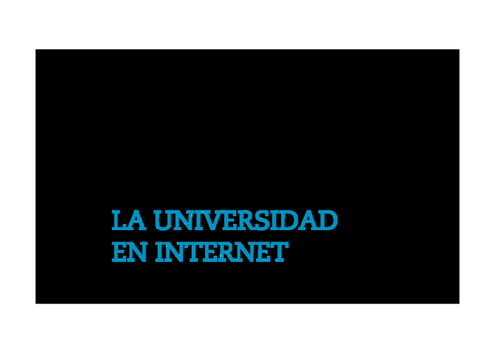

# Desarrollo Web con Frameworks Front-End



## Descripción

Estos proyectos fueron desarrollados como parte del máster en **Desarrollo Front-End**, dentro de la materia **Desarrollo Web con Frameworks**, con el propósito de aplicar los conocimientos adquiridos en la creación de **aplicaciones web funcionales, escalables y visualmente atractivas**.

Durante la materia se trabaja con frameworks modernos como **Angular** y **Vue.js**, explorando sus características, estructura modular y buenas prácticas de desarrollo.  
El objetivo principal es diseñar e implementar **interfaces de usuario interactivas** que cumplan con criterios de **usabilidad, accesibilidad y rendimiento**.

## Objetivos de la materia

- Comprender la arquitectura y ciclo de vida de componentes en Angular y Vue.js.
- Implementar comunicación entre componentes y consumo de servicios.
- Aplicar estilos y layouts responsive utilizando Bootstrap o Tailwind.
- Integrar APIs externas para mostrar información dinámica.

## Tecnologías Utilizadas

- **Angular v20**
- **Vue.js 3+**
- **Bootstrap 5.3.8**
- **TypeScript**
- **HTML5 / CSS3**
- **API REST**

## Instalación y Ejecución

1. Clonar el repositorio:

   ```bash
   git clone https://github.com/carloserick87/webcraft-frameworks.git


---

### 7. **Capturas de Pantalla**

Incluye imágenes o GIFs del proyecto en funcionamiento.

```markdown
## 🖼️ Capturas de Pantalla

### Página Principal


## 🌐 API Utilizada
La aplicación consume datos de la siguiente API:

```bash
https://mock.apidog.com/m1/1106172-1096392-default/new_releases


---

### 9. **Autor**

Autor: Carlos Erick Trujillo Mandujano
Programa: Máster Universitario en Diseño y Desarrollo de Interfaz de Usuario Web (MDIUW)
Institución: Universidad Internacional de La Rioja (UNIR) - España.


 


